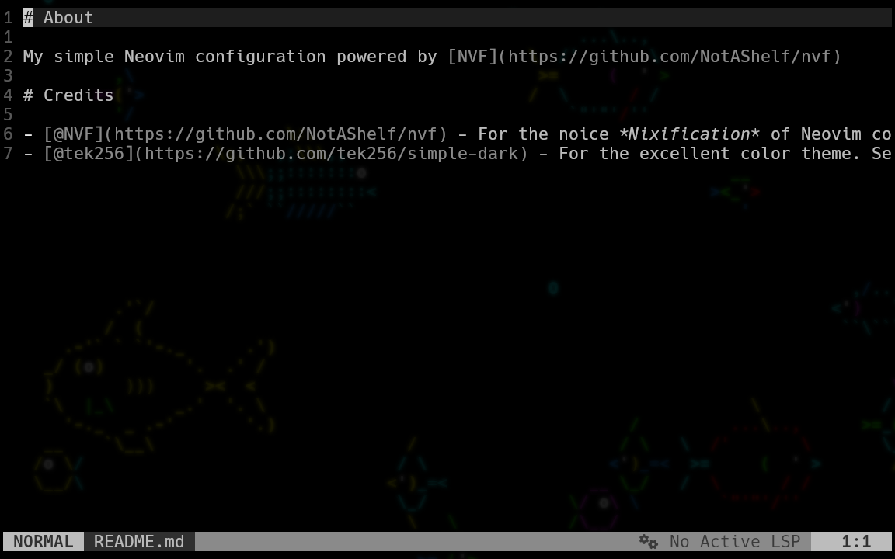

## About

My simple Neovim configuration powered by [NVF](https://github.com/NotAShelf/nvf)

## Credits

- [@NVF](https://github.com/NotAShelf/nvf) - For the noice *Nixification* of Neovim configuration
- [@tek256](https://github.com/tek256/simple-dark) - For the excellent color theme. Seeing Devon's setup on [Twitch](https://www.twitch.tv/tek256) is one of the things that got me into Neovim
- [Joan Stark](https://asciiart.website/art/5043) - For the Fox ASCII art
